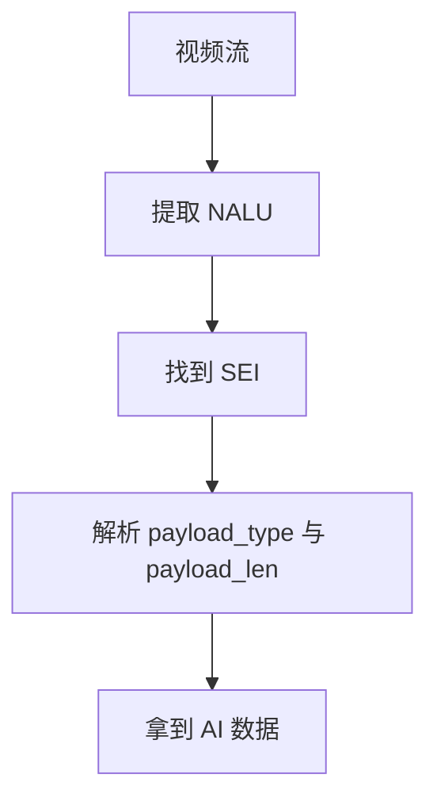
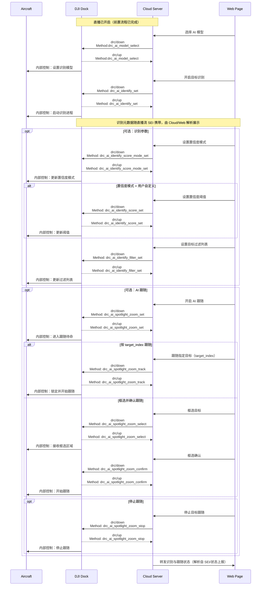

## 功能概述

大疆机场3支持AI识别功能，开启 AI 识别功能后，直播画面将实时显示识别到的目标。 算法支持人、车、船识别。 开启 AI 识别后，飞机的直播码流会在视频帧内携带 SEI（Supplemental Enhancement Information） 元数据。业务侧需要在拉流端解析 SEI，获取实时识别结果，并在直播画面叠加显示或做业务处理。 SEI 属于 H.264/H.265 码流中的帧对齐元数据，能够与视频内容严格对齐。

> **注意：** SEI 元数据目前只支持通过 Agora 声网和 WebRTC/WHIP 直播方式获取。

### AI 识别置信度

支持置信度的设置，置信度设置的是 AI 模型对识别目标的把握程度，设置的越高，检测更准，但可能漏检，设置的越低可识别更多的目标，但可能误检。 支持三种置信度策略模式，以适配不同业务目标。计数模式和搜救模式下系统会自动适配一个置信度阈值，用户无法调整。 如果需要自己设置阈值，可以使用自定义模式，由业务侧设置具体阈值（0–100）。

### AI 跟随

在已开启 AI 识别的前提下，支持飞行器对识别到的目标发起跟随：

点选跟随：对直播流SEI返回的目标列表选择一个 target_index 进行跟随。

框选跟随：提交画面归一化坐标的矩形框启动跟随，随后下发确认命令开始追踪。

### 状态推送

通过 drc_ai_info_push 推送 AI 功能相关状态，包括识别/跟随开关、跟随状态、当前选中模型与参数等，便于端侧做 UI 呈现与异常处理。

### SEI解析流程

在 DJI 上云 API 的直播流中，AI 识别结果是通过 SEI嵌入视频码流中传输的。 因此，开发者需要解析 SEI 数据，才能在本地实时获取识别信息。 解析流程如下：



图. SEI数据流结构（H.265示例）


**注意**
 • 上图展示的是 **HEVC / H.265** 下的 SEI NAL-unit 结构，仅用于说明 SEI payload 的组织方式 (sei_type / sei_len / payload)。
 • 目前大疆机场3推送 **H.264 (Annex-B)** 流，则 SEI NAL 单元应以 `00 00 00 01 06` 开头 (nal_unit_type = 6)，之后解析 custom sei_type (0xF5) 和 payload 结构保持不变。
 • 若使用Agora声网直播，sei_type为0x65而非0xf5

1.拆除extension sei中的0x03防竞争字节：在 Annex-B中，若出现0x00 0x00 0x03，需要把0x03删除，因为它是防止出现伪NALU起始码的填充字节。

2.对于 H.264 (Annex-B) 流，应识别 00 00 00 01 06 f5 开头作为 SEI NAL (nal_unit_type = 6)； 对于 H.265，比特流中若找到 00 00 00 01 50 01 f5 开头的 NAL，即为 SEI NAL；若使用Agora声网直播，sei_type为0x65而非0xf5； 随后解析 sei_len + extension SEI，再按 H.26x 协议计算：连续 0xFF 累加加上最后一个非 0xFF 字节，例如 0xFF 0xFF 0x03 → sei_len = 255 + 255 + 3 = 513。

```
payload_size = 0;
while (next_byte()== OxFF）{
payload_size += 255;
read_byte();
payload_size +=next_byte();//第一个非 OxFF 的字节
```

3.在payloads中找到type为07的payload type（固定2字节），获取payloadlength （固定2字节)，然后获取目标payload。

4.目标payload结构

```
// 顶层：随 SEI 携带的目标数据
typedef struct {
    uint8_t  version;          // 版本号
    uint32_t time_stamp;       // 时间戳（单位：ms）
    uint8_t  frame_type;       // 0 = invalid（无效帧）／1 = base（有效帧）
    uint8_t  frame_ext[12];    // 仅当 frame_type == 1 (BASE) 时存在：12 字节扩展区
    uint16_t track_id;         // 跟踪轨迹 ID
    uint8_t  reserved2;        // 保留字段
    uint8_t  obj_group_count;  // 紧随其后的是 obj_group_count 个 dji_ai_obj_data_group
    dji_ai_obj_data_group obj_groups[1]; // 变长数组起点：实际元素数量由 obj_group_count 决定
} payload;
```

补充结构（为顶层主结构的从属说明） 这些结构由 payload.obj_groups 引用，用于承载具体的分组数据与元素。

```
// 分组：一个 group 仅包含一种数据类型
typedef struct {
    // type 取值：
    //   10: dji_ai_obj_2d_box_with_distance（目标框 + 距离）
    //   12: dji_ai_obj_type_count（目标类型计数）
    //   其他值：忽略（前向兼容）
    uint8_t type;
    uint8_t count;      // 本 group 的元素个数
    // data 紧随其后：当 type=10 → count 个 dji_ai_obj_2d_box_with_distance
    //               当 type=12 → count 个 dji_ai_obj_type_count
    uint8_t data[1];    // 变长起点
} dji_ai_obj_data_group;

// 目标框 + 距离
typedef struct {
    uint16_t id;        // 目标实例 ID
    uint8_t  type;      // 目标类别：见 DJI_AI_OBJECT_TYPE
    uint8_t  state;  // 目标识别状态：见 DJI_TARGET_MANAGER_OBJ_STATE
    uint16_t cx;        // 框中心 X，单位：1/10000 × 画面宽
    uint16_t cy;        // 框中心 Y，单位：1/10000 × 画面高
    uint16_t w;         // 框宽，单位同上
    uint16_t h;         // 框高，单位同上
    uint32_t distance;  // 距离（mm）
} dji_ai_obj_2d_box_with_distance;

// 各类别目标数量
typedef struct {
    uint8_t  type;      // 目标类别：见 DJI_AI_OBJECT_TYPE
    uint16_t count;     // 数量
} dji_ai_obj_type_count;

// 目标类别枚举
typedef enum {
    INVALID = 0,
    UNKNOWN = 1,
    PERSON  = 2,
    CAR     = 3,
    BOAT    = 4,
} DJI_AI_OBJECT_TYPE;

//目标识别状态枚举
typedef enum {
	INVALID = 0, // 无效状态
	TRACKED = 1, // 稳定跟随状态
	VISION_BEACON_FUSIONED = 2, // 视觉beacon融合状态
	AUXILIARY_TRACKED = 3, // 触发源丢失，辅助观测跟随状态
	NOT_CONFIDENT = 4, // 不稳定跟随状态
	LOST_WITH_PREDICT = 5, // 目标丢失，TE维持预测状态
	LOST = 6, // 目标丢失状态
	REDETECTED = 7, // 目标丢失重找回状态
	COMMON_VIRTUAL_POINT = 8, // 虚拟点
} DJI_TARGET_MANAGER_OBJ_STATE;
```

## 交互时序图



## 接口详细实现

[远程控制](https://developer.dji.com/doc/cloud-api-tutorial/cn/api-reference/dock-to-cloud/mqtt/dock/dock3/remote-control.html#ai%E8%AF%86%E5%88%AB%E5%BC%80%E5%85%B3%E8%AE%BE%E7%BD%AE)

- AI模型选择
- AI识别开关设置
- AI跟随开关设置
- 设置AI识别目标过滤列表
- AI识别目标跟随
- AI框选目标跟随
- AI框选目标跟随确认
- 停止目标跟随
- 设置AI识别置信度模式
- 设置AI识别置信度
- 重置AI识别置信度
- AI状态上报
