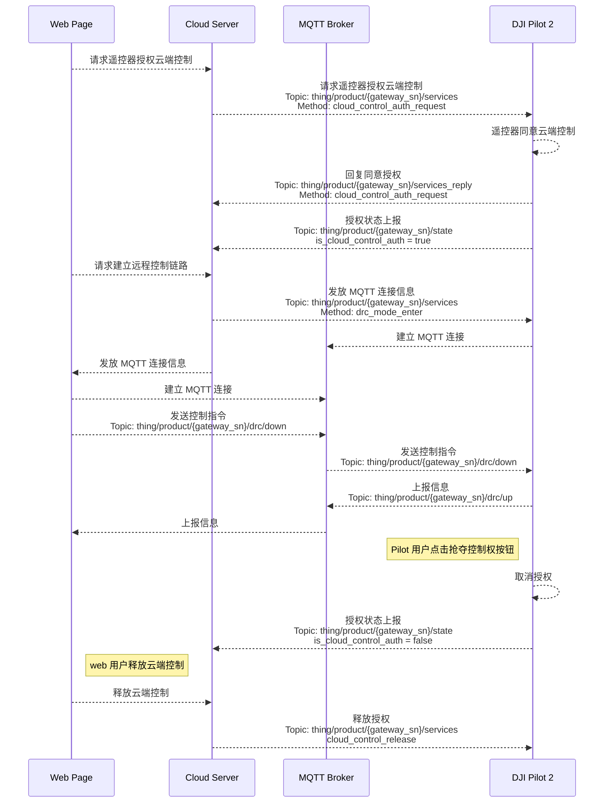

## 功能概述

Pilot 上云开放远程控制功能，云端可以通过 Pilot 转发数据，远程操控飞行器。

云端需要遥控器授权后才能操控。云端发起远程操控请求时，遥控器上会弹窗提醒，用户同意云端操控后，云端方能进行操作。
 对于 Mavic 3 行业系列和 DJI Matrice 4 系列机型，**不区分飞行和负载控制权**。

对于 Mavic 3 行业系列机型，仅支持云端操控负载，可以控制云台转动、变焦、红外操作等功能。云端远程操控时，遥控器上也能继续通过摇杆飞行。

对于 DJI Matrice 4 系列机型，支持云端操控飞行和负载。除了负载指令外，还支持飞行操控、指点飞行、环绕飞行等功能。云端远程操控时，遥控器上的拨轮、摇杆、返航、急停等按键将失效。

指令飞行 API 可以划分为：飞行控制类（DRC）、负载控制类、flyto 指令与一键起飞指令。

- 飞行控制类指令（DRC）

  DRC（drone remote control）使用 MQTT 协议，并新增两个 Topic 表示上行与下行。[MQTT Topic 定义](https://developer.dji.com/doc/cloud-api-tutorial/cn/api-reference/dock-to-cloud/mqtt/topic-definition.html)中对新增 drc Topic 结构体提供了介绍与示例。云端与设备成功建立 MQTT 连接以后，将分配一个 EMQX Broker 专门用于云端到设备端的 DRC 通信链路，使得传输与响应更快。DRC 指令需要提前开启指令飞行控制模式才能使用。DRC 指令一般不受飞行控制权的限制，但 `DRC-杆量控制 Method: sitck_control`的使用必须有飞行控制权。

图. DRC 链路

- 负载控制类指令：负载控制类指令都需要负载控制权。当前负载控制类指令控制相机与云台的动作，实现相机的拍照录像、相机变焦、云台重置等负载操作，从而获取目标的信息。
- flyto 指令与一键起飞指令：flyto 指令与一键起飞都用于让飞行器飞向目标点并悬停，区别在于前者用于飞行器在空中的场景，后者用于飞行器在机场内的场景。通过一键起飞指令飞到目标点后，飞行器后续可以继续执行 flyto 指令。当前仅支持单目标点。

## 交互时序图

> **注意：** 建议在下发指令飞行 API 前执行控制权抢夺，以防多方同时对飞行器发送指令导致飞行器故障。

## 接口详细说明

> **说明：** 需要在 DJI Pilot 界面上开启 “媒体上传”，通过负载控制指令拍摄的媒体文件才会被媒体管理功能上传。如何开启媒体上传可以[参考 《大疆司空 2 使用说明》中的 “媒体库” 章节](https://fh.dji.com/user-manual/cn/media-files.html)。

[指令飞行](https://developer.dji.com/doc/cloud-api-tutorial/cn/api-reference/pilot-to-cloud/mqtt/dji-rc-plus-2/drc.html)

- 飞行控制类指令（DRC 指令）
- 负载控制类指令

[远程控制](https://developer.dji.com/doc/cloud-api-tutorial/cn/api-reference/pilot-to-cloud/mqtt/dji-rc-plus-2/remote-control.html)
